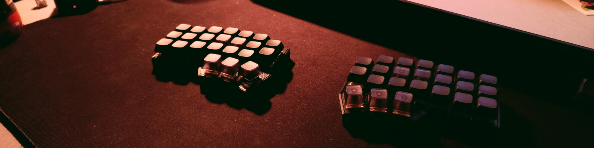
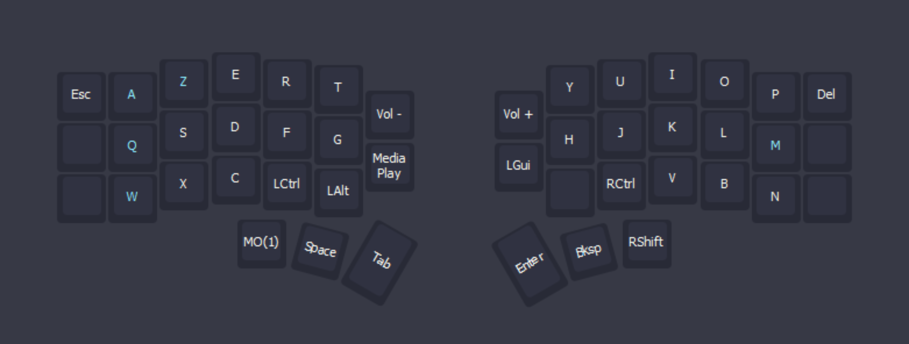
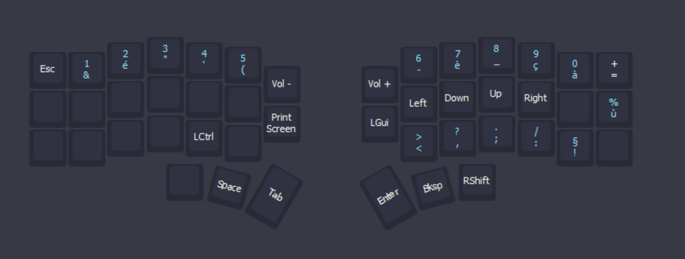

# will-crkbd

This repo contains my personal **AZERTY-inspired layout** for a **6×3 Corne (CRKBD)**, designed for French devs who want to:

- Use a **cheap but solid split keyboard**,
- Type and code **more comfortably**,
- **Keep their muscle memory** for classic AZERTY-FR keyboards.

---

## 💡 Why?

As a dev student, I wanted:

- A more **ergonomic** way to code,
- A way to **type faster** without destroying my wrists,
- A layout that doesn’t completely break my brain when I go back to a laptop or an office keyboard.

So I went with:

- A **wireless Corne** (6×3, low cost – ~40€),
- **46 Akko Creamy Yellow** switches,
- **46 blank keycaps** (because why not suffer a bit more).

Since I’m French and still use a lot of regular French keyboards, I decided to build an **AZERTY-FR-like layout** for the Corne so I can switch between both worlds smoothly.

---

## 🎹 Goals of the Layout

- ✅ **AZERTY-friendly**: letters are close to a classic FR layout  
- ✅ **Dev-focused**: easy access to symbols like `{ } [ ] ( ) ; : _ - / \`  
- ✅ **Layer-based**: numbers, arrows, functions, media and navigation on layers  
- ✅ **Comfort-first**: minimal finger travel, thumb usage boosted

---

## 🧠 Layer Overview

> The exact keymaps are in this repo as VIAL firmware config files.  

### Base layer 

### Second layer

I use the two inner keys for practical media control and for the super key.
This layout gonna evolve and change in time to be as better as possible.
It misses some keys also: they are coming soon ...
